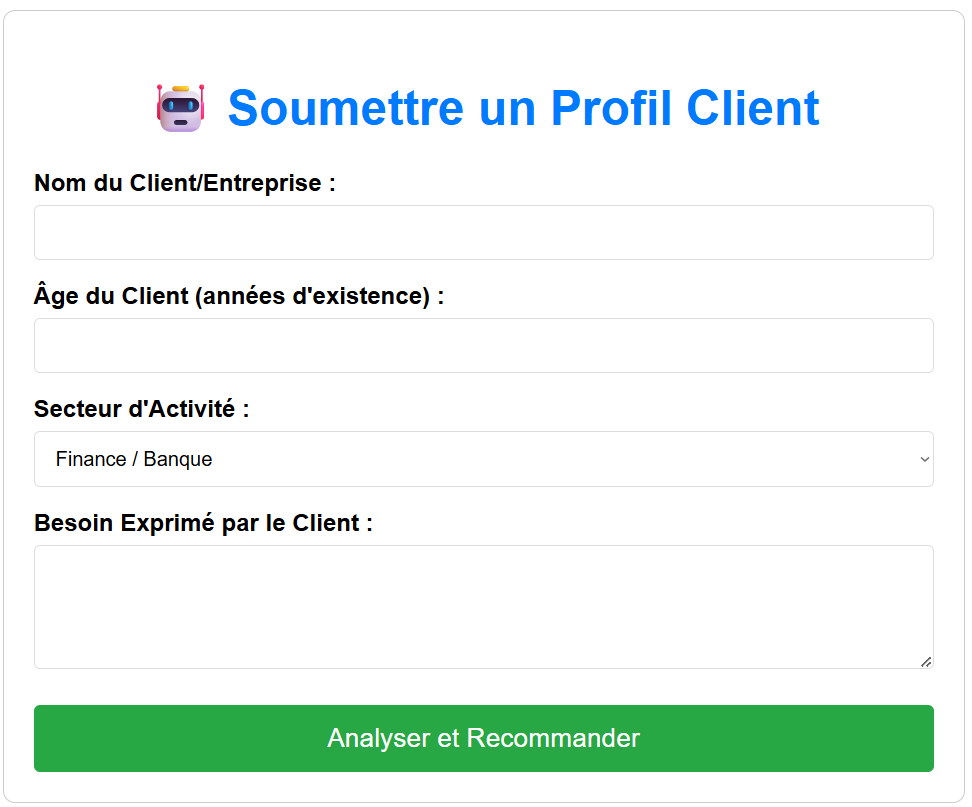
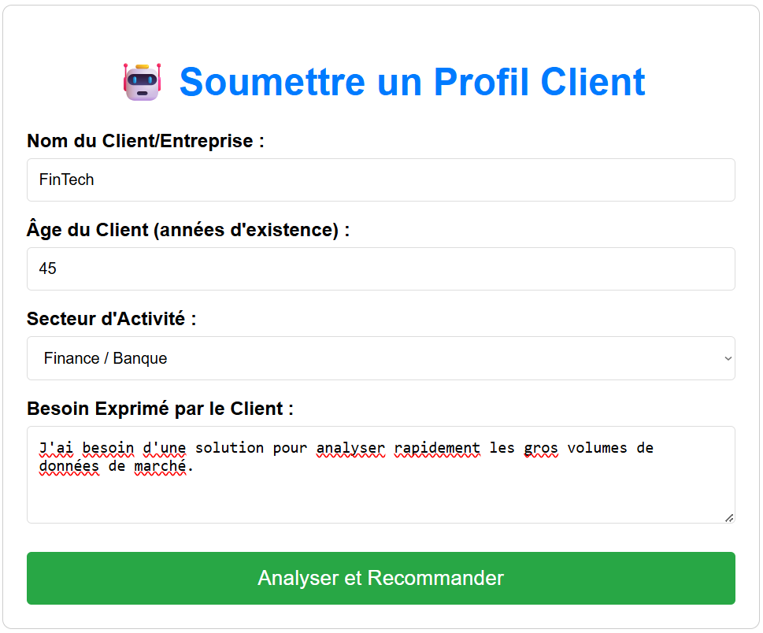
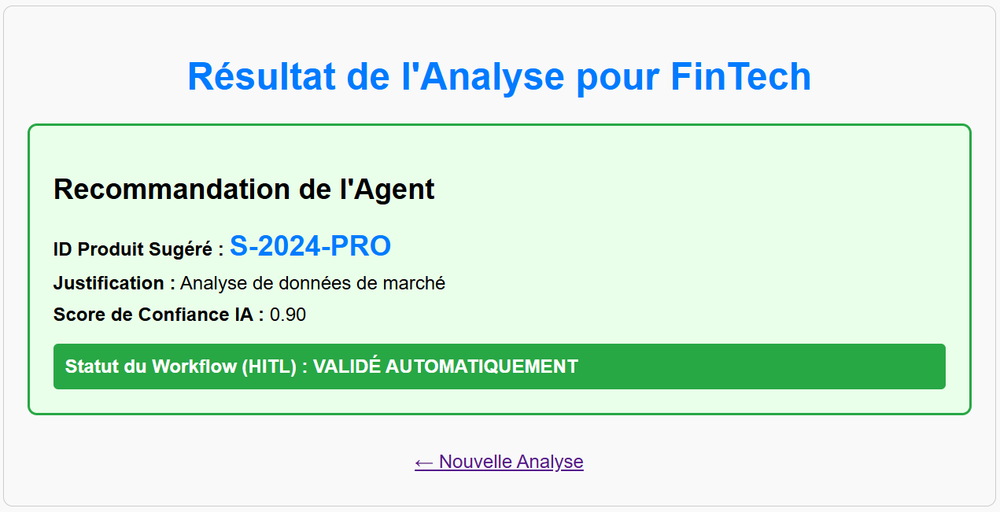

# 🤖 Django LangChain Groq Agent - AI-Powered Recommendation System

A production-ready Django web application that integrates **LangChain** with **Groq's LPU** technology to deliver intelligent, real-time product recommendations powered by AI. Built with a Human-in-the-Loop (HITL) validation system for enterprise-grade reliability.


## ✨ Features

- **🚀 High-Speed AI Inference** - Leverages Groq's Language Processing Units (LPUs) for sub-100ms response times
- **🔒 Type-Safe Data Handling** - Pydantic schemas for automatic validation and serialization
- **🧠 Intelligent Recommendations** - Multi-parameter analysis using LLaMA 3.3-70B via Groq
- **👤 Human-in-the-Loop (HITL)** - Confidence-based validation workflow that routes low-confidence recommendations to human experts
- **🌐 Dual Interface** - Both REST API and web-based UI for flexibility
- **📊 Production Architecture** - Built on LCEL (LangChain Expression Language) for scalability and observability
- **🛡️ Secure Configuration** - Environment-based API key management

---

## 🎯 Use Case

This system analyzes client profiles (age, sector, needs) and recommends the most suitable product or service from your catalog. The HITL workflow ensures that ambiguous or low-confidence recommendations receive human validation before being delivered to clients.

**Perfect for:**
- B2B SaaS product recommendations
- Financial advisory systems
- Enterprise solution matching
- Intelligent customer onboarding

---

## 📸 How It Works - Visual Walkthrough

### 1️⃣ Step 1: Submit Client Profile
The user-friendly form collects essential client information to feed into the AI agent.



### 2️⃣ Step 2: Example Test Case
Here's the form filled with a real-world example - a 45-year-old finance sector client with specific data analysis needs.



### 3️⃣ Step 3: Get Intelligent Recommendation
The AI analyzes the profile and returns a structured recommendation with confidence scoring. The HITL status shows whether it's auto-approved or needs manual review.



---

## 🏗️ Architecture

```
┌─────────────────────┐
│   User Interface    │
│   (Django Web UI)   │
└──────────┬──────────┘
           │
┌──────────▼──────────┐
│  Django REST API    │
│  (REST Framework)   │
└──────────┬──────────┘
           │
┌──────────▼───────────────────┐
│  LangChain Agent             │
│  • Prompt Engineering        │
│  • Output Parsing (Pydantic) │
│  • Chain Orchestration (LCEL)│
└──────────┬───────────────────┘
           │
┌──────────▼───────────┐
│  Groq LPU (LLaMA 3.3)│
│  Language Model      │
└──────────────────────┘
```

---

## 📦 Project Structure

```
sri_project/
├── manage.py                           # Django management script
├── requirements.txt                    # Python dependencies
├── .env                               # Environment variables (API keys)
├── db.sqlite3                         # SQLite database
│
├── sri_project/                       # Main Django project
│   ├── settings.py                    # Django configuration
│   ├── urls.py                        # URL routing
│   ├── asgi.py
│   └── wsgi.py
│
├── agent_service/                     # Core application
│   ├── groq_agent.py                  # LangChain + Groq logic
│   ├── models.py                      # Database models
│   ├── views.py                       # API views & web interface
│   ├── serializers.py                 # Data serialization
│   ├── urls.py                        # App URL routing
│   ├── admin.py
│   ├── apps.py
│   └── templates/
│       └── agent_service/
│           ├── form.html              # Client profile form
│           └── result.html            # Recommendation results
│
├── screenshots/                       # Documentation images
│   ├── form.png
│   ├── test.png
│   └── result.png
│
└── venv/                              # Python virtual environment
```

---

## 🚀 Quick Start

### Prerequisites

- Python 3.8+
- pip package manager
- Groq API key (free at [console.groq.com](https://console.groq.com))

### Installation

1. **Clone the repository**
   ```bash
   git clone <your-repo-url>
   cd sri_project
   ```

2. **Create and activate virtual environment**
   ```bash
   # Windows
   python -m venv venv
   .\venv\Scripts\activate
   
   # macOS/Linux
   python3 -m venv venv
   source venv/bin/activate
   ```

3. **Install dependencies**
   ```bash
   pip install -r requirements.txt
   ```

4. **Configure environment variables**
   
   Replace the API Key in the `.env` file with your own Groq API Key :
   ```env
   GROQ_API_KEY=gsk_your_api_key_here
   ```

5. **Run database migrations**
   ```bash
   python manage.py migrate
   ```

6. **Start the development server**
   ```bash
   python manage.py runserver
   ```

7. **Access the application**
   - Web UI: http://127.0.0.1:8000/api/
   - API endpoint: POST http://127.0.0.1:8000/api/analyze/

---

## 🧪 Test the Agent

### Web UI Testing

Simply navigate to **http://127.0.0.1:8000/api/** and fill in the form. Here are some example profiles to test:

#### ✅ Test Case 1: High Confidence (Auto-Approved)
- **Name:** TechVenture Inc.
- **Age:** 45
- **Sector:** Technologie / IT
- **Need:** We need advanced AI-powered analytics to process massive datasets and generate predictive insights for our customers.

**Expected Result:** S-2024-PRO with confidence > 0.80 → **VALIDÉ AUTOMATIQUEMENT**

---

#### ✅ Test Case 2: Finance Sector Deep Analysis
- **Name:** Goldman Analytics Partners
- **Age:** 62
- **Sector:** Finance / Banque
- **Need:** Complex real-time market data analysis with machine learning pipelines for algorithmic trading strategies. Our team needs millisecond-level performance.

**Expected Result:** S-2024-PRO with confidence > 0.85 → **VALIDÉ AUTOMATIQUEMENT**

---

#### ✅ Test Case 3: Migration Scenario
- **Name:** Legacy Systems Corp
- **Age:** 38
- **Sector:** Industrie / Fabrication
- **Need:** We're running on outdated on-premise infrastructure and want to modernize to cloud-based solutions for better scalability and cost efficiency.

**Expected Result:** C-2024-MIG with confidence > 0.80 → **VALIDÉ AUTOMATIQUEMENT**

---

#### ✅ Test Case 4: Small Business (Basic Needs)
- **Name:** Local Coffee Roasters Co.
- **Age:** 7
- **Sector:** E-commerce / Retail
- **Need:** Simple inventory management system to track stock levels and basic reporting.

**Expected Result:** B-2024-ESS with confidence > 0.75 → **VALIDÉ AUTOMATIQUEMENT**

---

#### ⚠️ Test Case 5: Low Confidence (Manual Review Needed)
- **Name:** Mystery Corp Holdings
- **Age:** 3
- **Sector:** Autre
- **Need:** Something that would be nice to have, not sure exactly what we need.

**Expected Result:** Low confidence < 0.70 → **À_VALIDER_MANUEL** ⚠️ (Flagged for human review)

---

#### ⚠️ Test Case 6: Ambiguous Requirements
- **Name:** XYZ Consultants Ltd.
- **Age:** 52
- **Sector:** Autre
- **Need:** We need a solution but haven't decided exactly what direction to go in yet. Maybe cloud, maybe data, maybe both?

**Expected Result:** Low confidence → **À_VALIDER_MANUEL** (Human expert intervention required)

---

### API Testing with cURL

#### Example 1: High Confidence Request
```bash
curl -X POST http://127.0.0.1:8000/api/analyze/ \
  -H "Content-Type: application/json" \
  -d '{
    "name": "DataFlow Analytics",
    "age": 35,
    "sector": "Technologie",
    "need_description": "We need enterprise-grade data pipeline infrastructure with real-time processing capabilities for our 500+ daily transactions"
  }'
```

**Response (200 OK):**
```json
{
  "product_id": "S-2024-PRO",
  "justification_courte": "Perfect fit for complex real-time data processing needs in tech sector.",
  "score_confiance": 0.88,
  "hitl_status": "VALIDÉ_AUTO"
}
```

---

#### Example 2: Low Confidence Request
```bash
curl -X POST http://127.0.0.1:8000/api/analyze/ \
  -H "Content-Type: application/json" \
  -d '{
    "name": "Startup Experiment",
    "age": 2,
    "sector": "Autre",
    "need_description": "Just something useful I guess"
  }'
```

**Response (202 ACCEPTED):**
```json
{
  "product_id": "B-2024-ESS",
  "justification_courte": "Basic solution suggested, but unclear requirements warrant expert review.",
  "score_confiance": 0.62,
  "hitl_status": "À_VALIDER_MANUEL"
}
```

---

#### Example 3: Cloud Migration
```bash
curl -X POST http://127.0.0.1:8000/api/analyze/ \
  -H "Content-Type: application/json" \
  -d '{
    "name": "Industrial Automation Ltd.",
    "age": 28,
    "sector": "Industrie",
    "need_description": "Legacy on-premise systems need modernization. Looking to migrate infrastructure to cloud for scalability, disaster recovery, and reduced operational costs"
  }'
```

**Response (200 OK):**
```json
{
  "product_id": "C-2024-MIG",
  "justification_courte": "Cloud migration service ideal for transitioning legacy infrastructure.",
  "score_confiance": 0.84,
  "hitl_status": "VALIDÉ_AUTO"
}
```

---

### Direct Agent Testing

Test the agent directly without the web interface:
```bash
python agent_service/groq_agent.py
```

This runs a built-in test with predefined inputs and shows the raw agent output.

---

## 🧠 LangChain Components

### Prompt Engineering
- **System Role**: Expert B2B product consultant
- **Confidence Scoring Rules**: Clear thresholds for HITL triggering
- **Product Catalog**: Three predefined solutions with specific use cases

### Output Parsing
- **Pydantic Schema**: Strict type validation on LLM output
- **Automatic JSON Conversion**: Groq response → Python object
- **Error Handling**: Graceful fallback on API failures

### Chain Architecture (LCEL)
```python
chain = prompt | llm | parser
```

This declarative pipeline ensures:
- Traceable execution flow
- Type-safe data transformation
- Observable intermediate results
- Easy debugging and testing

---

## 🔐 Security Features

- ✅ API keys stored in `.env` (never in code)
- ✅ Environment-based configuration via `python-dotenv`
- ✅ Input validation with Django REST Framework serializers
- ✅ CSRF protection on web forms
- ✅ Type validation with Pydantic

---

## 🔄 Confidence-Based Workflow (HITL)

| Confidence Score | Status | HTTP Code | Action |
|---|---|---|---|
| **> 0.80** | High confidence | 200 OK | ✅ Auto-approved, immediate delivery |
| **0.70 - 0.80** | Medium confidence | 200 OK | ✅ Auto-approved with notification |
| **< 0.70** | Low confidence | 202 ACCEPTED | ⚠️ Flagged for human expert review |

**When HITL is triggered:**
- Ambiguous or unclear customer needs
- Atypical customer profiles (very young/old companies)
- Multi-product scenarios with trade-offs
- Novel use cases not in training data

---

## 🛠️ Technology Stack

| Component | Technology | Purpose |
|---|---|---|
| Backend Framework | Django 4.2+ | Web application foundation |
| REST API | Django REST Framework | API endpoints |
| AI/ML Orchestration | LangChain Core | Chain composition & agents |
| Language Model | Groq LLaMA 3.3-70B | Fast inference via LPU |
| Data Validation | Pydantic | Type-safe schemas |
| Database | SQLite | Development (upgradeable) |
| Configuration | python-dotenv | Environment management |

---

## 📈 Performance Metrics

- **LLM Response Time**: ~50-100ms (Groq LPU advantage)
- **API Latency**: <200ms end-to-end
- **Temperature Setting**: 0.1 (deterministic, JSON-safe)
- **Model**: LLaMA 3.3-70B-Versatile (free on Groq)

---

## 📊 Database Models

### UserProfile
Stores client information:
- `name` (CharField) - Client/company name
- `age` (IntegerField) - Years in business
- `sector` (CharField) - Industry sector
- `need_description` (TextField) - Client's stated needs

### Recommendation
Stores AI-generated recommendations:
- `profile` (ForeignKey) - Associated client profile
- `product_id` (CharField) - Recommended product
- `justification_courte` (TextField) - Reasoning summary
- `score_confiance` (FloatField) - Confidence metric (0.0-1.0)
- `created_at` (DateTimeField) - Timestamp

---

## 📚 Learning Resources

- [LangChain Documentation](https://python.langchain.com/)
- [Groq Console](https://console.groq.com/)
- [Django REST Framework Guide](https://www.django-rest-framework.org/)
- [Pydantic Validation](https://docs.pydantic.dev/)

---

## 📝 License

This project is licensed under the MIT License - see the [LICENSE](LICENSE) file for details.

---

## 🎓 Educational Value

This project demonstrates:
- ✅ LangChain fundamentals and advanced patterns
- ✅ Building production-grade AI applications
- ✅ Django + REST API integration
- ✅ Pydantic for data validation
- ✅ Human-in-the-Loop (HITL) workflows
- ✅ Type-safe Python development
- ✅ Environment-based configuration management

Perfect for learning modern AI/ML application development!

---

## 🎉 Credits

Built with ❤️ using:
- **LangChain** - AI orchestration framework
- **Groq** - Ultra-fast LPU inference
- **Django** - Web framework excellence
- **Pydantic** - Data validation champion

---

**Made with 🤖 and 🥤**